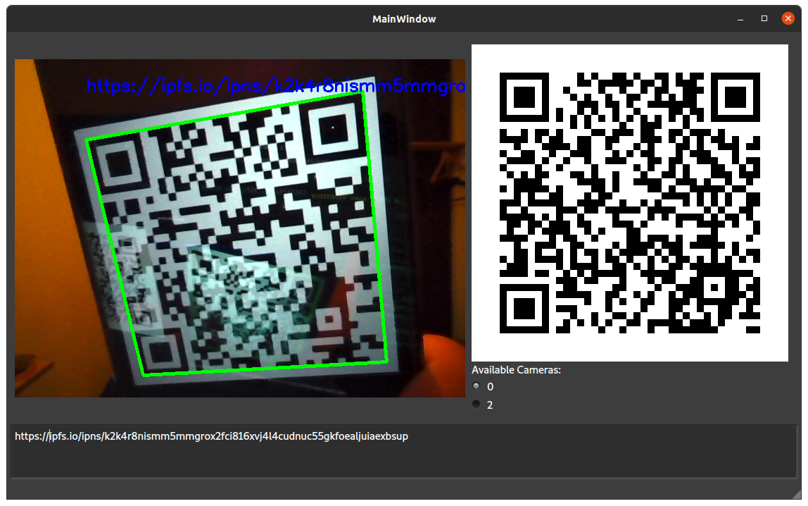

<style>img { width: 100%;}</style>

# QR ScanGen

_A simple cross-platform QR code scanner and generator._

Easy and fast to use, no buttons except to switch cameras.
Scanned QR codes are automatically copied to clipboard, open websites & connect to WiFi networks.

Written in Python, using the Qt GUI framework.



Portable executables (jsut for Linux so far) can be downloaded from IPFS:  
[ipns://ipns/k2k4r8nismm5mmgrox2fci816xvj4l4cudnuc55gkfoealjuiaexbsup#QR-ScanGen/Releases.md.html](http://ipfs.io/ipns/k2k4r8nismm5mmgrox2fci816xvj4l4cudnuc55gkfoealjuiaexbsup#QR-ScanGen/Releases.md.html)

## Features

- scan and decode QR-code from camera to text
- encode text to QR-code
- scanning actions for recognised content:
  - auto-copy to clipboard
  - auto-open URLs in default browser
  - auto-connect to WiFi networks (Linux tested, Windows 10 tested, MacOS untested)
- save QR-code image to file (click on it)
- no unnecessary click-work for user, all features in one simple page

## Download

Head over to the [releases page](https://github.com/emendir/QR-ScanGen/releases/) to download compiled binaries.
I maintain packages for:

- Linux:
  - AppImage
  - flatpak
- Windows:
  - EXE (portable) _Currently only for older versions of QR-ScanGen_ 
- MacOS: _none_

If no packages are available for your OS, see the section below on how to run this project from source.

## Run from source:

0. Prerequisites: You need [Python3](python.org) and a library manager for it (such as pip) installed on your computer.
1. Download this project and navigate to its folder:

```shell
git clone https://github.com/emendir/QR-ScanGen
cd ScanGen
```

2. Install the necessary python libraries:

```shell
pip3 install requirements.txt
```

3. Run the project:

```shell
python3 .
```

_You may need to replace pip3 with pip and python3 with python depending on your environment._

## Build from source:

1. perform all the steps in the _Run from source_ section above
2. install pyinstaller with:
   ```shell
   pip3 install pyinstaller
   ```
   (you may need to replace pip3 with pip depending on your environment)
3. run the `build.py` script with
   ```shell
   python3 build.py
   ```
4. The executable binary for your computer's operating system and computer architecture will be located in the [dist](./dist) folder.

## Links

This project's IPFS URL:  
[ipns://k2k4r8nismm5mmgrox2fci816xvj4l4cudnuc55gkfoealjuiaexbsup#QR-ScanGen](https://ipfs.io/ipns/k2k4r8nismm5mmgrox2fci816xvj4l4cudnuc55gkfoealjuiaexbsup#QR-ScanGen)
