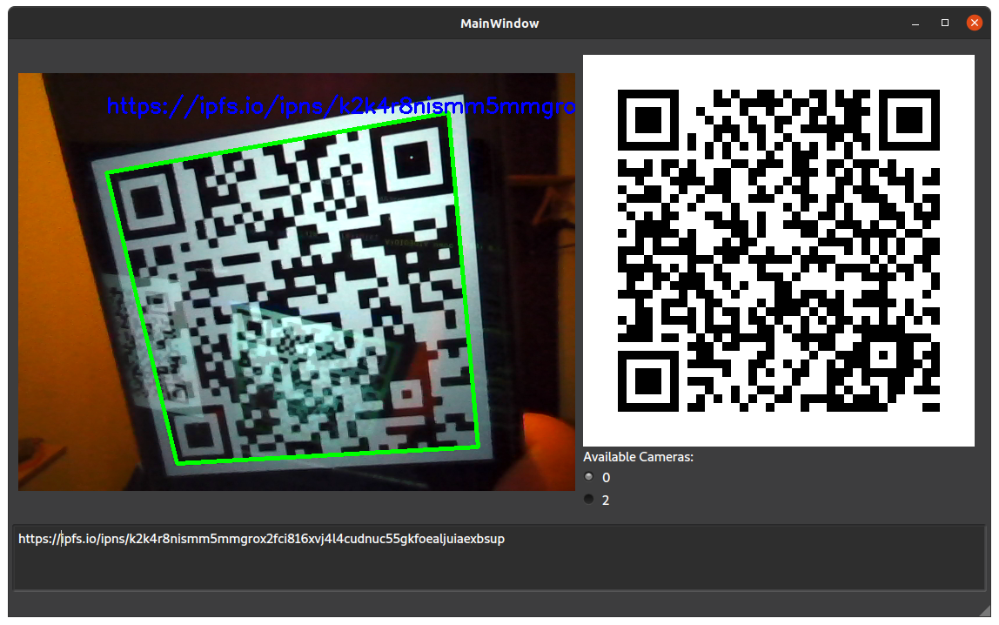

# QR ScanGen

A simple cross-platform QR code scanner and generator. Easy and fast to use, no buttons except to switch cameras. Scanned QR codes are automatically copied to clipboard.

Written in Python, using the Qt GUI framework.



Portable executables can be downloaded from IPFS:  
Linux: [ipns://k2k4r8n9gxr9jyqe3jzge4tdykag41zu6xezzgnynlx8eist1dtupev1](https://ipfs.io/ipns/k2k4r8n9gxr9jyqe3jzge4tdykag41zu6xezzgnynlx8eist1dtupev1)  
Windows: [ipns://k2k4r8mx3fftrqqnvk8kunbvy4r0jndvcecalm6x6khl8xv0mo8o5d0y](https://ipfs.io/ipns/k2k4r8mx3fftrqqnvk8kunbvy4r0jndvcecalm6x6khl8xv0mo8o5d0y)

## Run from source:
0. Prerequisites: You need [Python3](python.org) and a library manager for it (such as pip) installed on your computer.
1. Download this project and navigate to its folder:
  ```shell
  git clone https://github.com/emendir/QR-ScanGen
  cd ScanGen
  ```
2. Install the necessary python libraries:
  ```shell
  pip3 install requirements.txt
  ```
3. Run the project:
  ```shell
     python3 .
  ```
_You may need to replace pip3 with pip and python3 with python depending on your environment._

## Build from source:
1. perform all the steps in the _Run from source_ section above
2. install pyinstaller with:
    ```shell
    pip3 install pyinstaller
    ```
    (you may need to replace pip3 with pip depending on your environment)
3. run the `build.py` script with
   ```shell
   python3 build.py
   ```
4. The executable binary for your computer's operating system and computer architecture will be located in the [dist](./dist) folder.


## ToDo:
- connect to WiFi when scanning WiFi code: errors 'permission denied' on linux, untested on other OSs
- open URL in browser

This project is also hosted on IPFS:
[ipns://k2k4r8pruzwh3tmwsgypcimzfn9fq8svg7ikhyzq75bgl9nb1ncywhkn](https://ipfs.io/ipns/k2k4r8nismm5mmgrox2fci816xvj4l4cudnuc55gkfoealjuiaexbsup#QR-ScanGen)